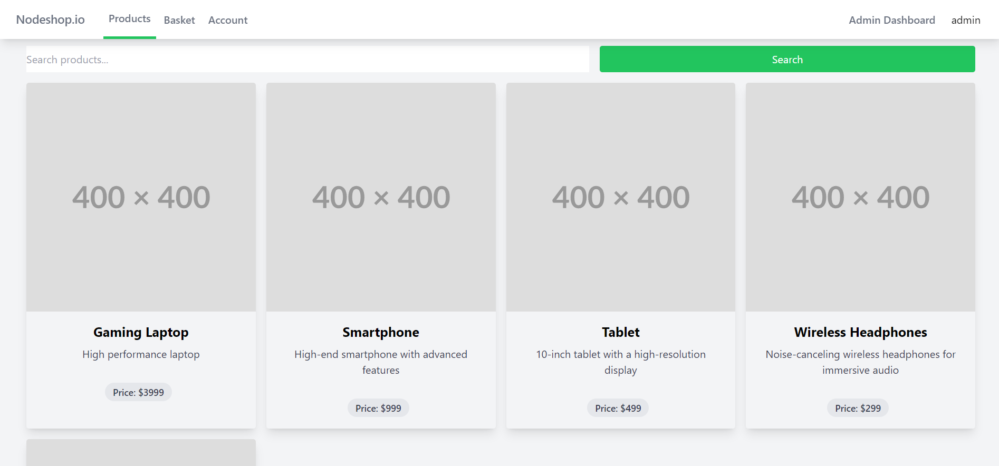
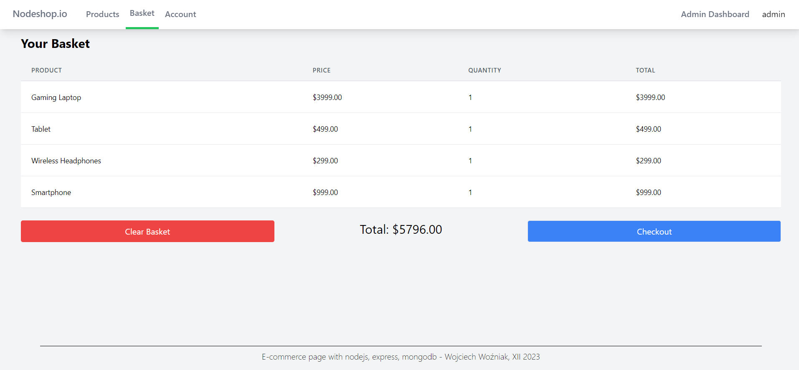

# Nodeshop.io

## About

Nodeshop.io is a simple e-commerce application built with Node.js, Express, and MongoDB. It is an end project for university course i attend.

All the data is stored in MongoDB Atlas cloud database. Entire frontend is built with EJS templating engine. I used Tailwind CSS for styling.

Authentication is done by simple username and password. Passwords are hashed with bcrypt. Authorization on routes is handled by custom middleware.

## Features
Main features required by the course:

### Not logged in user
- [x] View all products
- [x] Search for products
  
### Registered user
- [x] Create an account
- [x] Login/logout
- [x] Add product to basket
- [x] View basket, summary and checkout  

### Admin
- [x] Add/modify/delete product
- [x] See user list
- [x] See order list 

## Screenshots

### Home page

### Basket

## Installation
- Clone the repository
- Install dependencies with `npm install`
- Create credientials.json file in the root directory and add your MongoDB Atlas `databaseUser` and `databasePassword`
- Run the application with `npm start`
- After changing styles, run `npm run build-css` to compile Tailwind CSS and refresh with F5